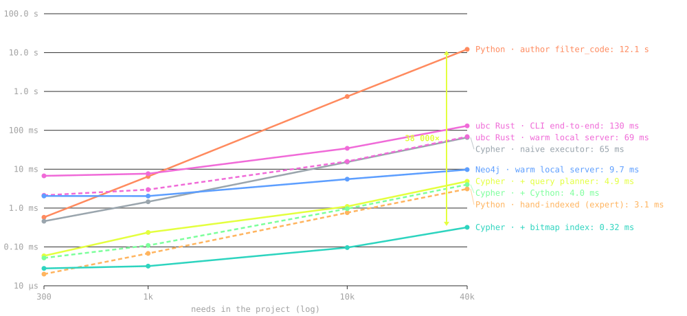

<div class="ub-kicker">useblocks · CTO case</div>

# Should useblocks open-source<br>declarative graph queries?

<div class="ub-rule"></div>

<div class="mt-6">Worked case with a reference implementation:<br><a href="https://github.com/lukasfailer/sphinx-needs-cypher">github.com/lukasfailer/sphinx-needs-cypher</a></div>

<div class="muted small mt-6">Lukas Failer</div>

<!--
Framing:
- This is the framing from the brief, section 3.
- The problem is not the query pain itself.
- The problem is the decision.
- We have proven internally that the same selection can be expressed in Cypher.
- Should that ability become part of the open-source tooling?
- Or should open source stay Python-only, with Cypher commercial?
- What does either choice mean for useblocks?
- The question has a technical half and a strategic half.
- The two halves are entangled.

Appendix:
- Everything after the "Backlog" divider is kept for questions and deep dives.
- It is not part of the main run-through.
- It holds the full benchmark table, the task and framing, and the engine internals.
-->

---
class: intro
---

<div class="ub-kicker">part a</div>

## The technical case: Cypher vs. Python

<div class="ub-rule"></div>

<div class="toc mt-6">
<div class="toc-item"><span class="n">1</span>Technical background</div>
<div class="toc-item"><span class="n">2</span>Identified problems</div>
<div class="toc-item"><span class="n">3</span>What I built</div>
<div class="toc-item"><span class="n">4</span>Benchmarks</div>
<div class="toc-item"><span class="n">5</span>The verdict</div>
</div>

---

<div class="ub-kicker">technical background · the data model</div>

## A Sphinx-Needs project is a property graph

<div class="ub-rule"></div>

<div class="cols mt-3">
<div>

```rst
.. req:: Brake must engage
   :id: REQ_001
   :status: open

.. spec:: ECU brake signal
   :id: SPEC_001
   :links: REQ_001
```

<div class="arrline">sphinx build ↓ <code>needs.json</code></div>

```json
{ "id": "SPEC_001", "type": "spec",
  "links": ["REQ_001"],
  "links_back": [] }
```

</div>
<div>

<svg viewBox="0 0 440 275" class="graphsvg" xmlns="http://www.w3.org/2000/svg">
  <defs>
    <marker id="arr" markerWidth="8" markerHeight="8" refX="7" refY="3" orient="auto">
      <path d="M0,0 L7,3 L0,6" fill="none" stroke="#a2a2a2" stroke-width="1.4"/>
    </marker>
  </defs>
  <!-- edges -->
  <line x1="140" y1="140" x2="205" y2="66" stroke="#a2a2a2" stroke-width="1.4" marker-end="url(#arr)"/>
  <text x="130" y="98" fill="#e4ff3e" style="font: 10px 'JetBrains Mono', monospace">implements</text>
  <line x1="335" y1="140" x2="278" y2="66" stroke="#a2a2a2" stroke-width="1.4" marker-end="url(#arr)"/>
  <text x="308" y="98" fill="#e4ff3e" style="font: 10px 'JetBrains Mono', monospace">derives_from</text>
  <line x1="90" y1="245" x2="90" y2="190" stroke="#a2a2a2" stroke-width="1.4" marker-end="url(#arr)"/>
  <text x="100" y="222" fill="#e4ff3e" style="font: 10px 'JetBrains Mono', monospace">verifies</text>
  <!-- nodes -->
  <g>
    <rect x="180" y="20" width="125" height="46" rx="9" fill="#141617" stroke="#e4ff3e" stroke-width="1.4"/>
    <text x="192" y="40" fill="#f3f3f3" style="font: 700 12px 'JetBrains Mono', monospace">REQ_001</text>
    <text x="192" y="56" fill="#a2a2a2" style="font: 9px 'JetBrains Mono', monospace">swreq · status=open</text>
  </g>
  <g>
    <rect x="30" y="142" width="125" height="46" rx="9" fill="#141617" stroke="#303030" stroke-width="1.4"/>
    <text x="42" y="162" fill="#f3f3f3" style="font: 700 12px 'JetBrains Mono', monospace">SPEC_001</text>
    <text x="42" y="178" fill="#a2a2a2" style="font: 9px 'JetBrains Mono', monospace">spec</text>
  </g>
  <g>
    <rect x="285" y="142" width="125" height="46" rx="9" fill="#141617" stroke="#303030" stroke-width="1.4"/>
    <text x="297" y="162" fill="#f3f3f3" style="font: 700 12px 'JetBrains Mono', monospace">REQ_002</text>
    <text x="297" y="178" fill="#a2a2a2" style="font: 9px 'JetBrains Mono', monospace">swreq</text>
  </g>
  <g>
    <rect x="30" y="247" width="125" height="26" rx="9" fill="#141617" stroke="#303030" stroke-width="1.4"/>
    <text x="42" y="264" fill="#f3f3f3" style="font: 700 12px 'JetBrains Mono', monospace">TEST_007</text>
  </g>
</svg>

</div>
</div>

<div class="verdict mt-3 small">A Sphinx-Needs project is a property graph: needs are <b>nodes</b>, typed links are <b>directed edges</b>.</div>

<!--
- Closed source (ubCode, ubTrace) and open source (Sphinx-Needs) share one data model.
- Teams embed engineering objects directly in the documentation as needs.
- Those objects are requirements, specs, test cases, risks and custom types.
- Every need has a unique ID and typed attributes such as status, tags and type.
- Every need has typed links to other needs.
- Every link option is a typed, directed edge.
- Link types are project configuration.
- Each link type gets an automatic reverse field, for example links_back.
- The demo project has 21 of them.
- Directives such as needtable and needflow render slices of this graph.
- Is this the full entity-relation model? Essentially yes.
- The only extras in needs.json are need parts and per-need document metadata.
- Need parts are sub-items addressable as ID.part, and they behave like sub-nodes.
- There are no further entity kinds.
-->

---

<div class="ub-kicker">technical background · views</div>

## Directives render views of the graph

<div class="ub-rule"></div>

<div class="mt-3"></div>

<svg viewBox="0 0 780 220" class="graphsvg" style="max-height:250px" xmlns="http://www.w3.org/2000/svg">
  <defs>
    <marker id="varr" markerWidth="8" markerHeight="8" refX="7" refY="3" orient="auto">
      <path d="M0,0 L7,3 L0,6" fill="none" stroke="#a2a2a2" stroke-width="1.4"/>
    </marker>
  </defs>
  <!-- edges into SWREQ_013 -->
  <line x1="222" y1="40" x2="296" y2="82" stroke="#a2a2a2" stroke-width="1.4" marker-end="url(#varr)"/>
  <text x="236" y="52" fill="#e4ff3e" style="font: 10px 'JetBrains Mono', monospace">links</text>
  <line x1="222" y1="112" x2="296" y2="99" stroke="#a2a2a2" stroke-width="1.4" marker-end="url(#varr)"/>
  <text x="230" y="122" fill="#e4ff3e" style="font: 10px 'JetBrains Mono', monospace">implements</text>
  <line x1="222" y1="186" x2="296" y2="114" stroke="#a2a2a2" stroke-width="1.4" marker-end="url(#varr)"/>
  <text x="240" y="172" fill="#e4ff3e" style="font: 10px 'JetBrains Mono', monospace">links</text>
  <!-- edge out of SWREQ_013 -->
  <line x1="492" y1="95" x2="586" y2="95" stroke="#a2a2a2" stroke-width="1.4" marker-end="url(#varr)"/>
  <text x="518" y="88" fill="#e4ff3e" style="font: 10px 'JetBrains Mono', monospace">links</text>
  <!-- nodes -->
  <g>
    <rect x="298" y="68" width="192" height="54" rx="9" fill="#141617" stroke="#e4ff3e" stroke-width="1.5"/>
    <text x="312" y="88" fill="#f3f3f3" style="font: 700 12px 'JetBrains Mono', monospace">SWREQ_013</text>
    <text x="312" y="104" fill="#a2a2a2" style="font: 9px 'JetBrains Mono', monospace">swreq · open · Adaptive Speed Limits</text>
  </g>
  <g>
    <rect x="20" y="15" width="200" height="46" rx="9" fill="#141617" stroke="#303030" stroke-width="1.4"/>
    <text x="32" y="34" fill="#f3f3f3" style="font: 700 11px 'JetBrains Mono', monospace">SWARCH_002</text>
    <text x="32" y="50" fill="#a2a2a2" style="font: 9px 'JetBrains Mono', monospace">swarch · ACC Subsystem</text>
  </g>
  <g>
    <rect x="20" y="90" width="200" height="46" rx="9" fill="#141617" stroke="#303030" stroke-width="1.4"/>
    <text x="32" y="109" fill="#f3f3f3" style="font: 700 11px 'JetBrains Mono', monospace">IMPL_ACC_SPEED</text>
    <text x="32" y="125" fill="#a2a2a2" style="font: 9px 'JetBrains Mono', monospace">impl · adjust_speed()</text>
  </g>
  <g>
    <rect x="20" y="164" width="200" height="46" rx="9" fill="#141617" stroke="#303030" stroke-width="1.4"/>
    <text x="32" y="183" fill="#f3f3f3" style="font: 700 11px 'JetBrains Mono', monospace">TEST_QUAL_002</text>
    <text x="32" y="199" fill="#a2a2a2" style="font: 9px 'JetBrains Mono', monospace">test · ACC Qualification</text>
  </g>
  <g>
    <rect x="588" y="76" width="130" height="38" rx="9" fill="#141617" stroke="#303030" stroke-width="1.4"/>
    <text x="600" y="93" fill="#f3f3f3" style="font: 700 11px 'JetBrains Mono', monospace">REQ_004</text>
    <text x="600" y="107" fill="#a2a2a2" style="font: 9px 'JetBrains Mono', monospace">req</text>
  </g>
</svg>

<div class="flowrow mt-2" style="max-width:820px; margin-left:auto; margin-right:auto">
<div class="node hot" style="text-align:center"><div class="ico">✂️</div><div class="t">a directive selects a slice</div></div>
<div class="arr">→</div>
<div class="node" style="text-align:center"><div class="ico">📊</div><div class="t"><code>needtable</code></div></div>
<div class="node" style="text-align:center"><div class="ico">🕸️</div><div class="t"><code>needflow</code></div></div>
<div class="node" style="text-align:center"><div class="ico">📋</div><div class="t"><code>needlist</code></div></div>
</div>

<div class="verdict mt-3 small">Every view stands or falls with <b>how it selects its needs</b>.</div>

<!--
- The value of the model comes from views generated into the documentation.
- needtable, needflow and needlist render slices of the graph.
- They render them as tables, lists or diagrams.
- What matters is how a directive decides which needs to show.
- That selection mechanism is the subject of the next slide.
- The graph shown is real data from data/needs.ubc.json.
- It is SWREQ_013 "Adaptive Speed Limits" with its actual neighbours.
- The ubTrace showcase project would work identically.
- The engine reads any needs.json export.
-->

---

<div class="ub-kicker">technical background · node selection</div>

## How node selection works

<div class="ub-rule"></div>

<div class="mt-4"></div>

<div class="cols">
<div>

<div class="colhead"><b>imperative Python</b></div>

```python
# "swreqs with no incoming link"
:filter_code: |
    for n in needs:
        if not incoming(n):
            results.append(n)
```

</div>
<div>

<div class="colhead"><b>declarative Cypher</b></div>

```cypher
MATCH (r:swreq)
WHERE NOT ( ()-->(r) )
RETURN r
```

</div>
</div>

<div class="cols mt-2">
<div class="info"><span class="i">ⓘ</span>code inside the docs, run per need at build time</div>
<div class="info"><span class="i">ⓘ</span>describes the result; an engine plans the execution</div>
</div>

<div class="cols mt-4">
<div><span class="badge oss">OSS</span> <span class="muted small">open-source Sphinx-Needs, today</span></div>
<div><span class="badge paid">€ commercial</span> <span class="muted small">ubCode only, since July</span></div>
</div>

<!--
- Everything a directive shows depends on how you select the slice.
- The Python path is imperative: the author writes the algorithm.
- sphinx-needs runs that algorithm per need, at build time.
- The Cypher path is declarative: the author states the result.
- An engine then decides how to compute it.
-->

---

<div class="ub-kicker">technical background · problem 1</div>

## Usability issue: the query

<div class="ub-rule"></div>

<div class="mt-3"></div>

<div class="chip">Python · first attempt</div>

```python
type == 'swreq' and not links_back
```

<div class="mark bad"><span class="g">✗</span><span>7 results, <b>5 of them wrong</b> · traced via other link types</span></div>

<v-click>

<div class="chip mt-3">Python · correct version</div>

```python
type == 'swreq' and not (links_back
  or implements_back or derives_from_back or depends_on_back or mitigates_back
  ...)  # all 21 link fields
```

<div class="mark ok"><span class="g">✓</span><span>correct, but the author must know <b>all 21 fields</b></span></div>
<div class="mark bad"><span class="g">✗</span><span>a new link type <b>silently breaks it</b></span></div>

</v-click>

<v-click>

<div class="chip lime mt-3">Cypher</div>

```cypher
MATCH (r:swreq) WHERE NOT ( ()-->(r) ) RETURN r
```

<div class="mark ok"><span class="g">✓</span><span>2 results, correct · one pattern, any edge type</span></div>

</v-click>

<!--
- The question is "which requirements are untraced?".
- The first Python attempt returns 7 results.
- 5 of them are wrong: they are traced through other link types.
- The correct filter must list every reverse link field by hand.
- The demo project has 21 of them.
- A newly configured link type silently breaks the filter again.
- Cypher returns 2 results, correct.
- The schema knowledge lives in the engine, not in the filter.
- This is a live user bug: sphinx-needs #1665, Feb 2026.
-->

---

<div class="ub-kicker">technical background · problem 2</div>

## Security issue: code injection

<div class="ub-rule"></div>

<div class="mt-3"></div>

- a `:filter:` runs Python from inside a `.rst` file, at build time, in CI

```python
# a :filter: inside any .rst file:
__import__('os').environ['CI_TOKEN']
```

<div class="mark bad"><span class="g">✗</span><span>leaked during the docs build</span></div>

<v-click>

```text
parse("__import__('os').system('id')")
```

<div class="mark ok"><span class="g">✓</span><span>rejected: expected MATCH at col 0 · Cypher is <b>parsed, never executed</b></span></div>

</v-click>

<v-click>

<div class="overlay-verdict" style="top:60%"><b>This friction keeps large-customer engineers from getting into Sphinx-Needs</b> — and the filter path is the finding a regulated CI review writes up.</div>

</v-click>

<!--
- filter_string and filter_code execute code embedded in the documents.
- That happens at build time, usually in CI, next to the secrets.
- The attack path is any docs PR from a fork.
- A vendored subtree or a dependency's docs works too.
- The working proof is in the repo: examples/security_rce_poc.py.
- The sphinx-needs docs say it themselves: "be sure to trust the input/writers".
- Cypher is parsed into a tree of typed nodes, never handed to an interpreter.
- No grammar rule reaches a system call.
- The worst a hostile query can do is be slow.
- A read-only engine bounds that.
-->

---

<div class="ub-kicker">what i built · 1 of 2</div>

## Prototype built with agents

<div class="ub-rule"></div>

<div class="artgrid mt-8">
<div class="node"><div class="ico">⚙️</div><div class="t">Cypher engine</div><div class="d">openCypher on any <code>needs.json</code></div></div>
<div class="node"><div class="ico">📄</div><div class="t">Sphinx integration</div><div class="d">a <code>needquery</code> directive</div></div>
<div class="node"><div class="ico">🔁</div><div class="t">Migration translator</div><div class="d"><code>filter_string</code> → Cypher</div></div>
<div class="node"><div class="ico">📊</div><div class="t">Benchmark engine</div><div class="d">all lanes, one command</div></div>
<div class="node"><div class="ico">✅</div><div class="t">Parity vs Rust engine</div><div class="d">identical rows · 5/5</div></div>
<div class="node"><div class="ico">🔒</div><div class="t">Tests + security demo</div><div class="d">56 tests · CI-secret PoC</div></div>
</div>

<!--
- Test bed: useblocks' own public demo project.
- 292 needs, a real ISO 26262 graph.
- Everything below was built agentically, in this repo.

Built:
- Cypher engine: reads any needs.json and answers openCypher queries.
- It is about 1 900 lines of Python.
- Sphinx integration: a needquery directive that renders in a real docs build.
- Migration translator: converts today's filter_string filters to Cypher.
- It is a thin compatibility layer, so existing users do not break.
- needquery/shim.py parses a filter_string with Python's own ast module.
- It translates the safe subset: type == 'swreq', and/or/not, 'x' in tags.
- Anything outside that subset is refused loudly, naming what it saw.
- It never emits a silently wrong query.
- It is the "nobody rewrites their filters by hand" piece of the recommendation.

Proof:
- Benchmark engine: every lane, 5 query types, 300 to 40 000 needs, one command.
- Parity vs the Rust engine: the same queries into my engine and commercial ubc.
- The rows match exactly, 5 out of 5.
- Tests and security demo: 56 tests across three executors.
- The demo shows that filter_code can read CI secrets.
-->

---

<div class="ub-kicker">what i built · 2 of 2</div>

## Graph engine iteration process

<div class="ub-rule"></div>

<div class="mt-8"></div>

- **2 × Python**, including the baseline
- **4 × Cypher**, one engine with different execution strategies

<!--
- Two Python lanes: what an author writes, what an expert writes.
- Four Cypher lanes: one engine, four execution strategies.
- The four are reference, planner, planner compiled with Cython, and bitmap.
- One parser and one language behind all four.
- The same 56 tests hold all of them to identical rows.
- The engine is a plain library: import needquery, load a needs.json, query it.
- No server is started at any point.
- The commercial ubc engine is the opposite: a separate Rust binary.
- Numbers come later, on the benchmark slides.
-->

---

<div class="ub-kicker">implementation 1 of 6 · python</div>

## Python · author: a scan inside a scan

<div class="ub-rule"></div>

<div class="implhead"><span class="timepill">40 000 needs: <b class="bad">12 134 ms</b></span></div>

<div class="cols mt-3">
<div>

```python
for n in needs:              # outer: every need
    for other in needs:      # inner: every need AGAIN
        if n.id in other.links: ...
```

<div class="limits">Not a strawman: <a href="https://github.com/useblocks/sphinx-needs/issues/1665">#1665</a> is exactly this filter, shipped in production.</div>

</div>
<figure class="diagram">

<svg viewBox="0 0 300 180" class="graphsvg" style="max-height:220px" xmlns="http://www.w3.org/2000/svg">
  <text x="10" y="16" fill="#a2a2a2" style="font: 10px 'JetBrains Mono', monospace">every need × every need:</text>
  <rect x="10" y="28" width="280" height="130" rx="6" fill="none" stroke="#303030"/>
  <g fill="#ffb45e" opacity=".85">
    <circle cx="30" cy="48" r="3"/><circle cx="55" cy="48" r="3"/><circle cx="80" cy="48" r="3"/><circle cx="105" cy="48" r="3"/><circle cx="130" cy="48" r="3"/><circle cx="155" cy="48" r="3"/><circle cx="180" cy="48" r="3"/><circle cx="205" cy="48" r="3"/><circle cx="230" cy="48" r="3"/><circle cx="255" cy="48" r="3"/>
    <circle cx="30" cy="73" r="3"/><circle cx="55" cy="73" r="3"/><circle cx="80" cy="73" r="3"/><circle cx="105" cy="73" r="3"/><circle cx="130" cy="73" r="3"/><circle cx="155" cy="73" r="3"/><circle cx="180" cy="73" r="3"/><circle cx="205" cy="73" r="3"/><circle cx="230" cy="73" r="3"/><circle cx="255" cy="73" r="3"/>
    <circle cx="30" cy="98" r="3"/><circle cx="55" cy="98" r="3"/><circle cx="80" cy="98" r="3"/><circle cx="105" cy="98" r="3"/><circle cx="130" cy="98" r="3"/><circle cx="155" cy="98" r="3"/><circle cx="180" cy="98" r="3"/><circle cx="205" cy="98" r="3"/><circle cx="230" cy="98" r="3"/><circle cx="255" cy="98" r="3"/>
    <circle cx="30" cy="123" r="3"/><circle cx="55" cy="123" r="3"/><circle cx="80" cy="123" r="3"/><circle cx="105" cy="123" r="3"/><circle cx="130" cy="123" r="3"/><circle cx="155" cy="123" r="3"/><circle cx="180" cy="123" r="3"/><circle cx="205" cy="123" r="3"/><circle cx="230" cy="123" r="3"/><circle cx="255" cy="123" r="3"/>
    <circle cx="30" cy="148" r="3"/><circle cx="55" cy="148" r="3"/><circle cx="80" cy="148" r="3"/><circle cx="105" cy="148" r="3"/><circle cx="130" cy="148" r="3"/><circle cx="155" cy="148" r="3"/><circle cx="180" cy="148" r="3"/><circle cx="205" cy="148" r="3"/><circle cx="230" cy="148" r="3"/><circle cx="255" cy="148" r="3"/>
  </g>
</svg>

<figcaption>O(N²): the whole grid gets touched, per directive.</figcaption>
</figure>
</div>

<!--
How it works:
- A loop over every need, evaluated per need, per directive, on every build.
- The "does anything link here?" check scans all needs again, inside the loop.
- That is 40 000 × 40 000 comparisons.

Why it matters:
- This is the shape real filters in the wild have.
- The author writes the algorithm, and the algorithm is a nested scan.
- sphinx-needs #1665 (Feb 2026) is a live user hitting exactly this.
- They got wrong "untraced" tables from a filter of this shape.
-->

---

<div class="ub-kicker">implementation 2 of 6 · python</div>

## Python · expert: scan once, ask many times

<div class="ub-rule"></div>

<div class="implhead"><span class="timepill">40 000 needs: <b>3.1 ms</b></span></div>

<div class="cols mt-3">
<div>

```python
incoming = set()
for n in needs:              # ONE pass
    incoming.update(n.links, n.implements, ...)

# the query is now O(1) per need:
type == 'swreq' and id not in incoming
```

<div class="limits">One hand-built index per query <b>shape</b> — and the author has to know the trick exists (it landed in core as <a href="https://github.com/useblocks/sphinx-needs/issues/328">#328</a>).</div>

</div>
<figure class="diagram">

<svg viewBox="0 0 300 180" class="graphsvg" style="max-height:220px" xmlns="http://www.w3.org/2000/svg">
  <text x="10" y="16" fill="#a2a2a2" style="font: 10px 'JetBrains Mono', monospace">one pass builds:</text>
  <rect x="10" y="26" width="120" height="120" rx="6" fill="none" stroke="#303030"/>
  <g fill="#ffb45e"><circle cx="30" cy="46" r="3"/><circle cx="60" cy="46" r="3"/><circle cx="90" cy="46" r="3"/><circle cx="30" cy="76" r="3"/><circle cx="60" cy="76" r="3"/><circle cx="90" cy="76" r="3"/><circle cx="30" cy="106" r="3"/><circle cx="60" cy="106" r="3"/><circle cx="90" cy="106" r="3"/><circle cx="30" cy="130" r="3"/><circle cx="60" cy="130" r="3"/><circle cx="90" cy="130" r="3"/></g>
  <path d="M135 86 L165 86" stroke="#e4ff3e" stroke-width="2" fill="none"/>
  <path d="M160 81 L167 86 L160 91" stroke="#e4ff3e" stroke-width="2" fill="none"/>
  <rect x="172" y="56" width="118" height="60" rx="8" fill="#1d1e1f" stroke="#7cff9b"/>
  <text x="184" y="80" fill="#f3f3f3" style="font: 700 10px 'JetBrains Mono', monospace">incoming = {…}</text>
  <text x="184" y="98" fill="#a2a2a2" style="font: 9px 'JetBrains Mono', monospace">the index (a dict)</text>
  <text x="170" y="140" fill="#7cff9b" style="font: 9px 'JetBrains Mono', monospace">then: 1 lookup per check</text>
</svg>

<figcaption>Scan once, ask many times.</figcaption>
</figure>
</div>

<!--
How it works:
- One pass records, for every link, its target — a plain dict.
- "Is REQ_001 traced?" stops being a scan and becomes one lookup.
- Same answer as the author's version, computed by building an index first.

Why it matters:
- This is the performance-aware engineer's version.
- Two limits matter for the argument.
- First: the index only serves one query shape.
- A different question needs a different index.
- Second: the author has to know that indexing is the move.
- The same technique was proposed for sphinx-needs core in issue #328.
- It was proposed by the co-founder, with his own filter benchmark.
-->

---

<div class="ub-kicker">implementation 3 of 6 · cypher</div>

## Cypher · reference: correct by construction

<div class="ub-rule"></div>

<div class="implhead"><span class="timepill">40 000 needs: <b>65.5 ms</b></span></div>

<div class="cols mt-3">
<div>

```python
for r in by_type["swreq"]:
    if not has_incoming(r):   # re-runs per r
        rows.append(r)
```

<div class="limits">Deliberately simple: it exists to be obviously correct — and to be the measuring stick for what the planner adds.</div>

</div>
<figure class="diagram">

<svg viewBox="0 0 300 180" class="graphsvg" style="max-height:220px" xmlns="http://www.w3.org/2000/svg">
  <text x="10" y="16" fill="#a2a2a2" style="font: 10px 'JetBrains Mono', monospace">text → tree → walked per row:</text>
  <rect x="10" y="30" width="100" height="26" rx="6" fill="#1d1e1f" stroke="#303030"/>
  <text x="20" y="47" fill="#f3f3f3" style="font: 9px 'JetBrains Mono', monospace">MATCH … WHERE</text>
  <path d="M115 43 L140 43" stroke="#e4ff3e" stroke-width="2"/><path d="M135 38 L142 43 L135 48" stroke="#e4ff3e" stroke-width="2" fill="none"/>
  <circle cx="200" cy="45" r="9" fill="none" stroke="#e4ff3e" stroke-width="1.5"/>
  <line x1="193" y1="52" x2="172" y2="76" stroke="#565b60"/><line x1="207" y1="52" x2="228" y2="76" stroke="#565b60"/>
  <circle cx="168" cy="82" r="7" fill="none" stroke="#565b60" stroke-width="1.4"/>
  <circle cx="232" cy="82" r="7" fill="none" stroke="#565b60" stroke-width="1.4"/>
  <line x1="164" y1="88" x2="150" y2="108" stroke="#565b60"/><line x1="172" y1="88" x2="186" y2="108" stroke="#565b60"/>
  <circle cx="148" cy="113" r="5" fill="none" stroke="#565b60" stroke-width="1.3"/>
  <circle cx="188" cy="113" r="5" fill="none" stroke="#565b60" stroke-width="1.3"/>
  <text x="40" y="150" fill="#a2a2a2" style="font: 10px 'JetBrains Mono', monospace">the query tree · walked once per candidate</text>
  <text x="40" y="167" fill="#ff6b6b" style="font: 10px 'JetBrains Mono', monospace">inner pattern: re-searched 39 998×</text>
</svg>

<figcaption>Correct by construction, slow by construction.</figcaption>
</figure>
</div>

<!--
- This is the first of the four engine strategies.
- "Parsed into a tree" means the AST.
- The parser turns the query text into a structure of typed nodes.
- For example: Match(label=swreq), then Where(Not(PatternPredicate(...))).
- The reference executor walks that structure exactly as written.
- It does no rewriting at all.
- Every swreq is a candidate, and the inner pattern is re-searched for each one.
- It is the honest baseline for the planner.
- Whatever the planner gains is measured against this.
- Same language, same data, same machine.
-->

---

<div class="ub-kicker">implementation 4 of 6 · cypher</div>

## Cypher · + planner: the expert's index, automatically

<div class="ub-rule"></div>

<div class="implhead"><span class="timepill">40 000 needs: <b>4.9 ms</b></span></div>

<div class="cols mt-3">
<div>

```python
cands = by_type["swreq"]   # 1 · pushdown
inc   = incoming_once()    # 2 · decorrelate
rows  = [r for r in cands
         if r not in inc]  # 3 · compiled
```

</div>
<figure class="diagram">

<svg viewBox="0 0 300 180" class="graphsvg" style="max-height:220px" xmlns="http://www.w3.org/2000/svg">
  <text x="10" y="16" fill="#a2a2a2" style="font: 10px 'JetBrains Mono', monospace">candidates per step:</text>
  <rect x="10" y="28" width="280" height="16" rx="3" fill="#3a3f44"/>
  <text x="16" y="40" fill="#f3f3f3" style="font: 9px 'JetBrains Mono', monospace">all needs · 39 998</text>
  <rect x="10" y="56" width="90" height="16" rx="3" fill="#565b60"/>
  <text x="106" y="68" fill="#f3f3f3" style="font: 9px 'JetBrains Mono', monospace">1 · pushdown → 506</text>
  <rect x="10" y="84" width="34" height="16" rx="3" fill="#7c8446"/>
  <text x="50" y="96" fill="#f3f3f3" style="font: 9px 'JetBrains Mono', monospace">2 · decorrelation → 1 lookup each</text>
  <rect x="10" y="112" width="14" height="16" rx="3" fill="#e4ff3e"/>
  <text x="30" y="124" fill="#e4ff3e" style="font: 9px 'JetBrains Mono', monospace">3 · compiled WHERE → one function</text>
  <text x="10" y="160" fill="#7cff9b" style="font: 11px 'JetBrains Mono', monospace">65.5 ms → 4.9 ms · same rows</text>
</svg>

<figcaption>The 13× that compilers can't buy.</figcaption>
</figure>
</div>

<v-click>

<div class="arrowbox mt-4">The planner builds the expert's index <b>automatically</b> — because the query says <b>what</b> is wanted, not <b>how</b> to compute it.</div>

</v-click>

<!--
The three rewrites:
- 1 · pushdown — start from the smallest bucket: 39 998 → 506.
- 2 · decorrelation — the inner pattern runs once, not per candidate.
- 3 · compiled WHERE — the filter becomes one function, not a tree walk.

Why it matters:
- Same parser and same tree as the reference executor.
- The difference: the planner rewrites the plan before anything runs.
- The sentence in the box is the entire technical argument.
- A planner needs declared intent.
- Cypher states the intent.
- filter_code buries it in arbitrary code, so nothing can rewrite it.
- Code: src/needquery/cypher/optimized.py
-->

---

<div class="ub-kicker">implementation 5 of 6 · the bonus</div>

## Cypher · + Cython: same file, minus the interpreter

<div class="ub-rule"></div>

<div class="implhead"><span class="timepill">40 000 needs: <b>4.0 ms</b></span></div>

<div class="cols mt-3">
<div>

```bash
./scripts/build_cython.sh   # optimized.py -> optimized.so
```

</div>
<figure class="diagram">

<svg viewBox="0 0 300 150" class="graphsvg" style="max-height:200px" xmlns="http://www.w3.org/2000/svg">
  <rect x="10" y="30" width="110" height="44" rx="8" fill="#1d1e1f" stroke="#e4ff3e"/>
  <text x="22" y="49" fill="#f3f3f3" style="font: 700 10px 'JetBrains Mono', monospace">optimized.py</text>
  <text x="22" y="65" fill="#a2a2a2" style="font: 9px 'JetBrains Mono', monospace">the planner, #4</text>
  <path d="M126 52 L162 52" stroke="#7cff9b" stroke-width="2"/><path d="M157 47 L164 52 L157 57" stroke="#7cff9b" stroke-width="2" fill="none"/>
  <text x="119" y="80" fill="#7cff9b" style="font: 9px 'JetBrains Mono', monospace">cython</text>
  <rect x="172" y="30" width="112" height="44" rx="8" fill="#1d1e1f" stroke="#7cff9b"/>
  <text x="182" y="49" fill="#f3f3f3" style="font: 700 10px 'JetBrains Mono', monospace">optimized.so</text>
  <text x="182" y="65" fill="#a2a2a2" style="font: 9px 'JetBrains Mono', monospace">native module</text>
  <text x="10" y="112" fill="#a2a2a2" style="font: 10px 'JetBrains Mono', monospace">4.9 ms → 4.0 ms · ~1.2×</text>
  <text x="10" y="132" fill="#7cff9b" style="font: 10px 'JetBrains Mono', monospace">planner, same file, better algorithm: 13×</text>
</svg>

<figcaption>Same file, minus the interpreter.</figcaption>
</figure>
</div>

<v-click>

<div class="arrowbox mt-4"><b>Compilers remove interpreter overhead. Planners fix algorithms.</b> An O(N²) algorithm, compiled, is a faster O(N²).</div>

</v-click>

<!--
- Yes, the Cython lane is still Cypher.
- It is the planned executor's unchanged source file, translated to C and compiled.
- Same algorithm, same language, same rows.
- The only change is that the Python interpreter is out of the loop.
- That is why it only buys about 1.2×: 4.9 ms to 4.0 ms.
- The planner's rewrite, on the same file, was 13×.
- The lane exists to isolate "faster machine code" from "better plan".
- It shows which of the two carries the result.
- It comes before the bitmap lane on purpose: it compiles the planner, not the bitmap.
-->

---

<div class="ub-kicker">implementation 6 of 6 · cypher</div>

## Cypher · + bitmap: the query as arithmetic

<div class="ub-rule"></div>

<div class="implhead"><span class="timepill">40 000 needs: <b class="good">0.32 ms</b></span></div>

<div class="cols mt-3">
<div>

```python
result = swreq_bm & ~incoming_bm   # two C-speed ops
```

<div class="limits">Index built once at load, rebuilt when needs change · shapes it cannot express fall back to the planner — <b class="good">same rows, always</b>.</div>

</div>
<figure class="diagram">

<pre class="bitrows">
needs        n0  n1  n2  n3  n4  n5  n6  n7
swreq         1   0   0   1   0   1   0   0
~incoming     1   0   1   1   1   0   0   1
<span class="hl">AND           1   0   0   1   0   0   0   0  ← result</span>
</pre>

<figcaption>The query as arithmetic.</figcaption>
</figure>
</div>

<!--
How it works:
- At load, every need becomes a bit position.
- One bitmap is built per type, per value and per edge kind.
- The whole WHERE collapses into bit algebra.
- Python's big integers are bitsets: the & runs in C, 64 needs per instruction.
- This is a third executor behind the same parser.

Limits:
- Bitmaps can only express per-need set logic.
- That means labels, attribute values, and incoming or outgoing edge existence.
- A multi-node join does not fit that shape.
- A variable-length path does not fit either.
- The engine detects those and hands the query to the planner.
- That is safe: both executors pass the same 56 tests.
- They must return identical rows, so the fallback changes speed, never answers.

Index cost:
- The index build is a one-time cost at load: 112 ms at 40 000 needs.
- While the data does not change, every supported query is near-instant.
- When needs change, the bitmaps are rebuilt on the next load.
- Real incremental behaviour needs a resident process.
- That is exactly what the commercial Rust engine is.
-->

---

<div class="ub-kicker">benchmarks · 1 of 3</div>

## The test data

<div class="ub-rule"></div>

<div class="mt-3"></div>

- synthetic trace graphs from a small generator script (`bench/generate.py`)
- the shape mirrors the demo project's safety hierarchy: safety goals → FSR → sysreq → swreq → impl / test
- **fixed random seed**: re-runs are byte-identical, every number reproducible

<div class="mt-2"></div>

<div class="tight">

| Needs | Why this size |
| --- | --- |
| 100 | small projects; the real demo project is 292 |
| 1 000 | typical mid-size project |
| 10 000 | the co-founder's own filter benchmark, <a href="https://github.com/useblocks/sphinx-needs/issues/328">#328</a> |
| 40 000 | the brief's "30 000 needs" · the ~50k automotive project with 2 to 5 hour builds, <a href="https://github.com/useblocks/sphinx-needs/issues/1219">#1219</a> |

</div>

<!--
- The generator builds a realistic traceability shape.
- Typed needs: safety_goal, fsr, sysreq, req, swreq, impl, test.
- They carry typed links and attributes such as status and asil.
- Total size is about 4× the number of swreqs.
- The PRNG is deterministic and seeded per run.
- So the reference engine and the filter path see the identical graph.
-->

---

<div class="ub-kicker">benchmarks · 2 of 3</div>

## The method

<div class="ub-rule"></div>

<div class="mt-4"></div>

- **9 lanes**: my six implementations, the commercial `ubc` Rust binary, and Neo4j
- **4 sizes**: 300 to 40 000 needs
- **identical rows** are enforced across all lanes, and any mismatch aborts the run

<div class="colhead mt-5"><b>5 workloads</b> · the question each one asks</div>

<div class="flowrow mt-3" v-click="1">
<div class="node"><div class="t">1 · attribute filter</div><div class="d">which software requirements are open?</div><div class="q">MATCH &#40;r:swreq&#41;<br>WHERE r.status = 'open'<br>RETURN r</div></div>
<div class="arr">→</div>
<div class="node"><div class="t">2 · anti-join</div><div class="d">which ones does no test point at?</div><div class="q">MATCH &#40;r:swreq&#41;<br>WHERE NOT &#40; &#40;r&#41;&lt;-[:links]-&#40;:test&#41; &#41;<br>RETURN r</div></div>
<div class="arr">→</div>
<div class="node"><div class="t">3 · two-hop join</div><div class="d">which ones sit under an ASIL-D safety goal?</div><div class="q">MATCH &#40;sr:sysreq&#41;-[:implements]-&gt;&#40;f:fsr&#41;<br>&nbsp;&nbsp;-[:derives_from]-&gt;&#40;s:safety_goal&#41;<br>WHERE s.asil = 'D'<br>RETURN sr</div></div>
<div class="arr">→</div>
<div class="node"><div class="t">4 · transitive closure</div><div class="d">what reaches that safety goal, at any depth?</div><div class="q">MATCH &#40;h:safety_goal&#41;&lt;-[&#42;1..]-&#40;n&#41;<br>WHERE h.id = 'SG_0'<br>RETURN n</div></div>
<div class="arr">→</div>
<div class="node hot"><div class="t">5 · all of it at once</div><div class="d">open requirements, on an open req, that nothing implements</div><div class="q">MATCH &#40;sr:swreq&#41;-[:links]-&gt;&#40;r:req&#41;<br>WHERE sr.status = 'open'<br>&nbsp;&nbsp;AND r.status = 'open'<br>&nbsp;&nbsp;AND NOT &#40; &#40;sr&#41;&lt;-[:implements]-&#40;:impl&#41; &#41;<br>RETURN sr</div></div>
</div>

<!--
Lanes:
- Each of my six implementations is measured in a fresh subprocess.
- The commercial ubc binary is measured as a cold CLI call and as a warm local server.
- Neo4j runs as a real server in a throwaway Docker container.
- Best of 5 runs per data point rules out CPU noise and warm caches.

Workloads:
- Workload 5 is the complex one, added after the review question "were these all simple queries?".
- It is a join, two attribute predicates and an anti-join in a single question.
- Raw runs and machine metadata are committed to the repo.
- One command runs everything: bench/benchmark.py
- --with-neo4j starts the container and removes it again.
- The commercial ubc engine is measured two ways.
- Cold CLI: process start, license check, cached-index load, query.
- Warm: "ubc serve mcp", with the index resident.
- Neo4j runs warm, and its 1.7 s bulk load is reported separately.
- Parity vs ubc 0.33 on the real demo graph: 5 out of 5.
- Different answers would mean measuring bugs, not speed.
- That is why a row mismatch aborts the run.
-->

---

<div class="ub-kicker">benchmarks · 3 of 3</div>

## Results: 300 to 40 000 needs

<div class="ub-rule"></div>



<v-click>

<div class="cols3 bench-overlay">
<div class="node"><div class="t"><span class="good">38 000×</span> author code → bitmap</div><div class="d">12.1 s to 0.32 ms at 40 000 needs · the planner alone: 4.9 ms, 2 500× faster than the status quo</div></div>
<div class="node"><div class="t">under 2 ms at 1 000 needs</div><div class="d">at small scale, speed is not the argument</div></div>
<div class="node"><div class="t">The honest exception: forward joins</div><div class="d">plain Python is already optimal there (1.8 ms vs our 2.7 ms) — we say so instead of overclaiming</div></div>
</div>

</v-click>

<div class="muted xsmall mt-2">Workload shown: the "untraced requirements" query. Raw data: <code>bench/results/</code> · chart: <code>bench/plot.py</code></div>

<!--
- The ladder at 40 000 needs, for the "untraced" query:
- Python author filter_code: 12 134 ms, an O(N²) scan re-run per directive.
- Cypher reference executor: 65.5 ms, it evaluates the inner pattern per need.
- Cypher planned: 4.9 ms, par with the hand-built expert at 3.1 ms.
- Cypher plus Cython: 4.0 ms, about 1.2×, because compilers do not fix algorithms.
- Cypher plus bitmap: 0.32 ms, the WHERE becomes two C-speed bit operations.
- Same language and same data: 65 ms, then 4.9 ms, then 0.32 ms.
- On workload 5, the complex one, the ranking changes.
- Python author 5 577 ms, reference 62.8 ms, planner 13.9 ms, Cython 11.8 ms.
- The bitmap falls back to the planner there: 13.9 ms, same rows.
- The hand-built expert is 4.9 ms — it beats the planner by about 3×.
- Say that out loud: on a complex query a tuned expert still wins on speed.
- The planner wins on every other axis: correctness, reach and no hand-tuning.
- The gap is the planner.
- A planner needs declared intent.
- Cypher states it; filter_code buries it in arbitrary code.
- External engines, same graph and query at 40 000 needs:
- Neo4j: 10.3 ms warm, after a 1.7 s bulk load.
- ubc: 75 ms warm local server, 156 ms cold CLI, 704 ms first index build.
- These are different process models, so startup and transport dominate.
- They are context, not competitors.
- The paid engine's real edge is incremental: the index persists.
-->

---

<div class="ub-kicker">the llm test</div>

## Easier for an LLM: measured

<div class="ub-rule"></div>

<div class="mt-3"></div>

- 12 tasks in plain English — one `filter_string` and one Cypher query each.
- The prompt is one text card: need types, fields, link names, and that language's syntax rules.

<v-click>

<div class="cols3 mt-4">
<div class="stat"><div class="n good">10/12</div><div class="l">correct in <b>Cypher</b></div></div>
<div class="stat"><div class="n">9/12</div><div class="l">correct as <b>filter_string</b></div></div>
<div class="stat"><div class="n bad">3/12</div><div class="l">tasks <b>cannot be written</b> as a filter_string at all</div></div>
</div>

</v-click>

<div class="muted xsmall mt-2">Script: <code>bench/llm_eval.py</code> · raw model answers + scoring: <code>bench/results/llm_eval.json</code></div>

<!--
- Read the experiment honestly, and do not overclaim.
- Simple tasks: both languages work — the gap is reach, not fluency.
- Why not writable: a filter_string is one boolean expression over the current need's own fields.
- It cannot look at another need or follow an edge.
- No repo, no example queries, no data were given.
- Both answers run on the real graph, scored against a known-correct result.
- On the 9 tasks expressible in both languages: filter_string 9/9, Cypher 8/9.
- The schema card lists 19 need types, 6 attributes and 21 link fields.
- It also states the rule that every link field X has a reverse field X_back.
- With it, the LLM even enumerated all 21 reverse-link fields correctly.
- The syntax block names the exact subset each language may use.
- So on single-need selections the difference is negligible.
- The 3 cross-need tasks are where it breaks.
- Task 1: swreqs no test points at.
- Task 2: sysreq to fsr to SG_01.
- Task 3: all needs transitively reaching SG_01.
- filter_string scored 0 out of 3, and the model knew why.
- The language cannot see other needs.
- Cypher scored 2 out of 3.
- Cypher's first miss: it used size(), which our deliberate subset does not have.
- That is a subset boundary, not a language problem.
- Cypher's second miss: it invented an edge type :test, but test is a node type.
- That one is a real model mistake.
- So the claim for the verdict table stays modest on flat tasks.
- It is decisive exactly where the reach row says filter_string ends.
- Method: claude CLI, model claude-sonnet-5, run from a neutral directory.
- Ground truths are computed in plain dict code in bench/llm_eval.py.
- Every raw answer is recorded in bench/results/llm_eval.json.
- The model saw nothing but the prompt: schema card, language rules, task sentence.
- Both languages started from identical information.
- So the difference in results is the language, not the prompt.
-->

---

<div class="ub-kicker">the verdict</div>

## Python vs. Cypher, per axis

<div class="ub-rule"></div>

<div class="tight">

| | <span class="grp-py">Python</span> | <span class="grp-cy">Cypher</span> |
| --- | --- | --- |
| Syntax, same selection | <code>type=='swreq' and status=='open'</code> | <code>MATCH (r:swreq) WHERE r.status='open'</code> |
| Attribute filters (status, type, tags) | correct | correct. No difference. |
| Link queries ("nothing links here") | correct only if the author enumerates every link field | <span class="good">correct by construction</span>: one pattern, any edge type |
| Reach (joins, transitive) | <span class="bad">`filter_string` cannot cross needs</span> · joins & closure need hand-written `filter_code` | <span class="good">built in</span>: typed edges, multi-hop, variable-length paths |
| Speed | fast only if hand-optimized, per query | <span class="good">engine optimizes automatically</span> |
| Security | <span class="bad">runs code embedded in the docs</span> at build time | parsed, never executed |
| AI agents / LLMs | measured: <span class="bad">9/12</span> tasks · blocked wherever a task crosses needs | measured: <span class="good">10/12</span> tasks · a standard language LLMs already know |

</div>

<v-click>

<div class="verdict mt-3"><b>Part A answers the code half: Cypher wins on correctness, reach, security and speed.</b> <span class="muted small">That is not what makes this decision hard.</span></div>

</v-click>

<!--
- Attribute filters are a tie.
- Link queries: Cypher is harder to get wrong.
- Security: Cypher.
- AI agents: Cypher.
- Speed: par with a hand-tuned expert.
- Speed: 2 500× over author code, and 38 000× with the bitmap fork.
- On the complex workload the planner is 400× over author code.
- There the hand-tuned expert is still about 3× faster than the planner.
-->

---
class: intro
---

<div class="ub-kicker">part b</div>

## The strategic case

<div class="ub-rule"></div>

<div class="toc mt-6">
<div class="toc-item"><span class="n">1</span>Market</div>
<div class="toc-item"><span class="n">2</span>Strategies</div>
<div class="toc-item"><span class="n">3</span>Evaluation</div>
<div class="toc-item"><span class="n">4</span>Verdict</div>
</div>

---

<div class="ub-kicker">strategy · the reframe</div>

## The real question is not which engine

<div class="ub-rule"></div>

<div class="mt-3"></div>

<v-click>

<div class="card mt-4">

**1 · Upstream adoption vs. lock-out**

- does open source **help or hurt** commercial sales?
- if Cypher stays paid, what is the OSS user's **fallback**?

</div>

</v-click>

<v-click>

<div class="card mt-5">

**2 · The AI / intent-layer dimension**

- a declarative language is the interface **agents** reach for
- the moat must not be attackable by our **own** open source

</div>

</v-click>

<!--
- This is the reframe the brief itself asks for.
- The brief asks about upstream adoption versus lock-out.
- Does putting this in OSS help or hurt adoption of the commercial tools?
- If Cypher stays commercial-only, what is the open-source user's fallback?
- Is that fallback acceptable to them?
- The brief also asks about the AI and intent-layer dimension.
- A declarative query language is a first-class interface for LLMs and agents.
- If the engine is open, a third party can put a CLI or an MCP over it.
- They can then drive an AI against the graph with very few moving parts.
- That capability is close to the core of the strategy.
- The moat should not be attackable by our own open-source tooling.
- The evaluation must reach an explicit conclusion on that.
- Say it plainly on stage: the challenge is not which engine.
- The code question is answered and reproducible.
- The decision is about adoption and about the moat.
- Both get an explicit answer later in this part.
-->

---

<div class="ub-kicker">market</div>

## Three competitors ship the same interface

<div class="ub-rule"></div>

<div class="cols3 mt-4">
<div class="node"><div class="t">Codebeamer Copilot</div><div class="d">PTC + Microsoft, co-developed with VW</div><div class="risk"><b>Risk:</b> sets the de-facto AI-requirements interface</div></div>
<div class="node"><div class="t">Polarion AI · Jama MCP</div><div class="d">feeds approved specs to coding agents today</div><div class="risk"><b>Risk:</b> locks agents to a proprietary API before a standard exists</div></div>
<div class="node"><div class="t">StrictDoc</div><div class="d">open substitute for sphinx-needs</div><div class="risk"><b>Risk:</b> ships open graph querying first</div></div>
</div>

<div class="cols3 mt-3">
<div class="stat"><div class="n">$4.4→6.8B</div><div class="l">ALM market 2025 to 2031</div></div>
<div class="stat"><div class="n">~5M</div><div class="l">Sphinx-Needs downloads — the funnel every paying logo came from</div></div>
<div class="stat"><div class="n">S-CORE</div><div class="l">Eclipse SDV stack pins sphinx-needs</div></div>
</div>

<v-click>

<div class="verdict mt-3 small"><b>Takeaway:</b> any of them can ship open graph querying first — then we <b>lose ground</b> instead of gaining <b>upstream adoption</b>.</div>

</v-click>

<!--
- "Competitors" means the established commercial players plus the open substitute.
- Codebeamer Copilot: PTC and Microsoft, co-developed with VW, a shared customer.
- Their distribution power could set the de-facto AI-requirements interface.
- Polarion AI and Jama MCP: Jama already feeds approved specs to coding agents.
- That is a proprietary requirements API, shipped before a standard exists.
- StrictDoc compares itself feature-for-feature with sphinx-needs.
- It could ship open graph querying first and take the open-standard seat.
- ALM market: $4.4B to $6.8B, 2025 to 2031 (Mordor Intelligence, the narrow frame).
- Sphinx-Needs downloads: about 5M (pepy.tech).
- S-CORE: the Eclipse SDV consortium pins sphinx-needs.
- Member companies maintain the integration (eclipse-score/docs-as-code).
-->

---

<div class="ub-kicker">demand</div>

## The open-source tracker asks for this

<div class="ub-rule"></div>

<div class="cols3 mt-4">
<div class="node"><div class="t"><a href="https://github.com/useblocks/sphinx-needs/issues/130">#130</a> · 2020</div><div class="d">"needs that are needed for a need, direct or indirect": a transitive query, still open</div></div>
<div class="node"><div class="t"><a href="https://github.com/useblocks/sphinx-needs/discussions/615">#615</a> · 2022</div><div class="d">reachability filter "very slow because it's called for every single need"</div></div>
<div class="node"><div class="t"><a href="https://github.com/useblocks/sphinx-needs/issues/1665">#1665</a> · 2026</div><div class="d">wrong "untraced requirements" tables, the exact failure in the worked example</div></div>
</div>

<div class="mt-5"></div>

- the pull is for the **capability**: graph-shaped queries, six years of asks
- nobody is asking useblocks to open-source its query **engine**
- openCypher, the language, is a public standard already
- the move can be made from strength, not under pressure

<!--
- "Open-sourcing Cypher" can only mean the engine.
- openCypher, the language, is a public standard that useblocks does not own.
- Nobody in the tracker is campaigning for the engine's source.
- The demand is for the query capability.
-->

---

<div class="ub-kicker">strategy</div>

## What is actually the moat?

<div class="ub-rule"></div>

<div class="mt-3"></div>

<div class="tight">

| Layer | Status | Defensible? |
| --- | --- | --- |
| Data model (`needs.json`) | <span class="open">open since 2011</span> | no. And that openness built the funnel |
| Query **language** (openCypher) | public standard | <span class="bad">no</span>. Anyone can implement it; this repo: ~1 900 lines |
| Query **engine** (Rust, incremental, LSP) | <span class="closed">closed · €</span> | <span class="good">yes</span>. A year of work, real architecture |
| Intent layer: workflows, gates, **write path** | <span class="closed">closed · €</span> | <span class="good">yes</span>. Stateful, audited, domain-deep |

</div>

<div class="muted xsmall mt-3">The moat is the bottom two rows — the two commercial (€) layers.</div>

<!--
- The question to carry into the strategies: which layer does a gate actually defend?
- A gate on an open layer defends nothing and costs goodwill.
- The defensible layers are the engine and the write path.
- Those are exactly the two commercial layers in the stack.
- The data model has been open since 2011, and it built the funnel.
- The language is a public standard nobody owns.
- The engine is a year of real architecture.
- The intent layer is stateful, audited and domain-deep.
-->

---

<div class="ub-kicker">evaluated strategy 1 of 4</div>

## Open everything

<div class="ub-rule"></div>

<div class="what mt-3">Apache-license the query engine too, not just the language. Monetize only above it.</div>

<div class="layers">
<div class="lyr open"><b>language</b>open</div>
<div class="lyr open"><b>engine</b>open</div>
<div class="lyr paid"><b>write path</b>paid</div>
</div>

<div class="proscons">
<div class="pro">
<h4>For</h4>
<ul>
<li>Claims the standard before PTC or Jama close it</li>
<li>Maximum funnel + S-CORE goodwill</li>
</ul>
</div>
<div class="con">
<h4>Against</h4>
<ul>
<li>Gives away the only shipped paid differentiator, a ~€400–600k Rust asset</li>
<li>Irreversible</li>
</ul>
</div>
</div>

<!--
- Monetize above the engine: server, agents, connectors, qualification.
- Against, moved off the slide: it resets the pricing anchor too early.
- The platform layer cannot carry that anchor yet.
-->

---

<div class="ub-kicker">evaluated strategy 2 of 4</div>

## Keep it fully gated

<div class="ub-rule"></div>

<div class="what mt-3">The status quo. Cypher stays commercial; open source keeps the Python filter dialect.</div>

<div class="layers">
<div class="lyr paid"><b>language</b>paid</div>
<div class="lyr paid"><b>engine</b>paid</div>
<div class="lyr paid"><b>write path</b>paid</div>
</div>

<div class="proscons">
<div class="pro">
<h4>For</h4>
<ul>
<li>Zero engineering cost before the Series A</li>
<li>The capability gap is the cleanest upsell trigger</li>
</ul>
</div>
<div class="con">
<h4>Against</h4>
<ul>
<li>OSS keeps the build-time code-execution surface</li>
<li>Leaves the open-standard seat to a consortium or StrictDoc</li>
</ul>
</div>
</div>

<!--
- Also for: nobody is campaigning to open Cypher.
- The pressure is on query pain, not on licensing.
- Also against: two diverging filter paths stay alive.
- Also against: OSS agents route around you.
- needs.json loads into Neo4j today.
-->

---

<div class="ub-kicker">evaluated strategy 3 of 4</div>

## Open the language, keep the engine

<div class="ub-rule"></div>

<div class="what mt-3">Ship the openCypher <b>language</b> in open-source sphinx-needs: frozen subset spec, shared conformance test-suite, pure-Python reference reader. The fast Rust <b>engine</b>, IDE and MCP/agent surface stay commercial.</div>

<div class="layers">
<div class="lyr open"><b>language</b>open</div>
<div class="lyr paid"><b>engine</b>paid</div>
<div class="lyr paid"><b>write path</b>paid</div>
</div>

<div class="proscons">
<div class="pro">
<h4>For</h4>
<ul>
<li>The only stable line: a standard can't be gated, an engine can</li>
<li>Retires the code-execution surface · the upgrade is the same language, faster</li>
</ul>
</div>
<div class="con">
<h4>Against</h4>
<ul>
<li>Small teams stop needing ubc for correct queries; they paid €0</li>
<li>Build: ~1–2 engineer-months · run: ⅕–½ engineer ongoing</li>
</ul>
</div>
</div>

<!--
- Also for: it retires the diverging filter paths.
- This repo is the prototype of the productization work.
- The ongoing cost covers the OSS surface.
- It also covers the shared conformance test-suite.
-->

---

<div class="ub-kicker">evaluated strategy 4 of 4</div>

## Ship the free binary, no source

<div class="ub-rule"></div>

<div class="what mt-3">Open no code. OSS sphinx-needs runs <code>:cypher:</code> by calling the <code>ubc</code> binary when installed — closed source, free for open-source use.</div>

<div class="layers">
<div class="lyr"><b>language</b>free binary, closed</div>
<div class="lyr"><b>engine</b>free binary, closed</div>
<div class="lyr paid"><b>write path</b>paid</div>
</div>

<div class="proscons">
<div class="pro">
<h4>For</h4>
<ul>
<li>Full engine performance for OSS users</li>
<li>Ships in weeks; binary and licensing model exist</li>
</ul>
</div>
<div class="con">
<h4>Against</h4>
<ul>
<li>Air-gapped CI, distros and S-CORE can't take a closed vendor binary</li>
<li>A dependency is not a standard; the open-standard seat stays empty</li>
</ul>
</div>
</div>

<!--
- This is the distribution model ubCode already uses today.
- Closed source, free for open-source use, licensed for commercial use.
- Also for: zero IP opened and zero new OSS code to maintain.
- Also against: the regulated buyers we court audit their supply chain.
-->

---

<div class="ub-kicker">evaluation</div>

## The four strategies, side by side

<div class="ub-rule"></div>

<div class="tight2 mt-2">

| | 1 · open all | 2 · gated | 3 · language | 4 · binary |
| --- | --- | --- | --- | --- |
| Community / S-CORE standing | <span class="good">strong</span> | <span class="bad">erodes</span> | <span class="good">good</span> | <span class="bad">weak</span> |
| Paid value prop afterwards | <span class="bad">gutted</span> | strong now, weaker later | <span class="good">clarified</span> | fine |
| Engineering cost | high | none | 1–2 months build, ⅕–½ engineer run | low |
| Upgrade path for OSS users | nothing left to sell | fallback stays slow, error-prone | <span class="good">same language, faster</span> | installs, but distrust |
| AI-agent strategy fit | leaks the agent surface | <span class="bad">agents route around you</span> | <span class="good">grows the pool you sell to</span> | neutral |
| Reversible? | <span class="bad">no</span> | any time | until the old path is deleted | any time |

</div>

<div class="muted xsmall mt-2">S-CORE: the Eclipse SDV consortium (BMW, Bosch, VW, …)</div>

---
class: intro
---

<div class="ub-kicker">recommendation</div>

## Open the language. Keep the engine.

<div class="ub-rule"></div>

<div class="mt-2"></div>

<svg viewBox="0 0 760 205" class="graphsvg" style="max-height:200px; width:auto; display:block; margin:0 auto" xmlns="http://www.w3.org/2000/svg">
  <defs>
    <marker id="rarr" markerWidth="9" markerHeight="9" refX="8" refY="3.5" orient="auto">
      <path d="M0,0 L8,3.5 L0,7" fill="none" stroke="#7CFF9B" stroke-width="1.6"/>
    </marker>
    <marker id="warr2" markerWidth="9" markerHeight="9" refX="8" refY="3.5" orient="auto">
      <path d="M0,0 L8,3.5 L0,7" fill="none" stroke="#ff6b6b" stroke-width="1.6"/>
    </marker>
  </defs>
  <!-- graph box -->
  <rect x="15" y="55" width="200" height="95" rx="12" fill="#141617" stroke="#303030" stroke-width="1.5"/>
  <text x="40" y="85" fill="#f3f3f3" style="font: 700 14px Inter, sans-serif">the graph</text>
  <text x="40" y="104" fill="#a2a2a2" style="font: 11px 'JetBrains Mono', monospace">needs.json</text>
  <circle cx="160" cy="120" r="7" fill="#0b0c10" stroke="#e4ff3e" stroke-width="1.3"/>
  <circle cx="120" cy="130" r="7" fill="#0b0c10" stroke="#565b60" stroke-width="1.3"/>
  <circle cx="185" cy="95" r="7" fill="#0b0c10" stroke="#565b60" stroke-width="1.3"/>
  <line x1="127" y1="128" x2="152" y2="122" stroke="#565b60" stroke-width="1.2"/>
  <line x1="166" y1="115" x2="179" y2="101" stroke="#565b60" stroke-width="1.2"/>
  <!-- read arrow -->
  <line x1="225" y1="80" x2="435" y2="52" stroke="#7CFF9B" stroke-width="2" marker-end="url(#rarr)"/>
  <text x="255" y="52" fill="#7CFF9B" style="font: 700 12px 'JetBrains Mono', monospace">read · MATCH … RETURN</text>
  <!-- write arrow -->
  <line x1="435" y1="160" x2="225" y2="132" stroke="#ff6b6b" stroke-width="2" marker-end="url(#warr2)"/>
  <text x="258" y="185" fill="#ff6b6b" style="font: 700 12px 'JetBrains Mono', monospace">write · into the record</text>
  <!-- open box -->
  <rect x="445" y="15" width="300" height="75" rx="12" fill="#0e140f" stroke="#7CFF9B" stroke-width="1.8"/>
  <text x="465" y="43" fill="#7CFF9B" style="font: 800 14px Inter, sans-serif">OPEN · free for everyone</text>
  <text x="465" y="64" fill="#a2a2a2" style="font: 11px Inter, sans-serif">every query that reads the graph</text>
  <!-- commercial box -->
  <rect x="445" y="115" width="300" height="80" rx="12" fill="#140e0e" stroke="#ff6b6b" stroke-width="1.8"/>
  <text x="465" y="141" fill="#ff6b6b" style="font: 800 14px Inter, sans-serif">🔒 COMMERCIAL</text>
  <text x="465" y="160" fill="#a2a2a2" style="font: 11px Inter, sans-serif">writes: round-trip, RBAC, audit</text>
  <text x="465" y="177" fill="#a2a2a2" style="font: 11px Inter, sans-serif">+ the fast engine, the IDE, the agents</text>
</svg>


<!--
- This is not a feature tier.
- It is the line between reading published data and writing into the system of record.
- A MATCH returns nodes and never touches workflows, reviews or the write path.
- Why a feature split is the wrong frame:
- A Community-vs-Professional tier gates different amounts of the same capability.
- Some queries free, better queries paid.
- That line is unstable.
- The language is a public standard.
- The data model has been open since 2011.
- So the gated "feature" is reimplementable by anyone, in about 1 900 lines.
- Reads vs writes is an architectural boundary between two different systems.
- One system publishes build output: needs.json, open all along.
- The other writes into a stateful, access-controlled, audited system of record.
- The first cannot be defended; the second can.
- Why strategy 3:
- A gate on a public standard defends nothing and costs goodwill.
- The engine, IDE and agent surface are real assets, and they stay paid.
- Open: every query that reads the graph.
- Commercial: the fast engine, the IDE, the agents.
- Commercial: every write into the system of record.
-->

---

<div class="ub-kicker">recommendation · the toolsuite</div>

## Move Cypher to the open side

<div class="ub-rule"></div>

<div class="eco mt-4">
<div class="ecocol">
<div class="ecobox paid"><span class="tag">€</span><div class="nm">ubCode</div><div class="ds">real-time validation, ontology checks, AI guardrails</div></div>
<div class="ecobox paid"><span class="tag">€</span><div class="nm">ubConnect</div><div class="ds">unify ALM tools into one traceable pipeline</div></div>
</div>

<div class="ecoarr move"><div class="lbl">Cypher</div><div class="ar">⟶</div></div>

<div class="ecocol">
<div class="ecobox oss"><span class="tag">OSS</span><div class="nm">sphinx-needs</div><div class="ds">create, manage &amp; validate structured needs</div></div>
<div class="ecorow">
<div class="ecobox oss"><span class="tag">OSS</span><div class="nm">Codelinks</div><div class="ds">trace code ↔ docs</div></div>
<div class="ecobox oss"><span class="tag">OSS</span><div class="nm">Test-Reports</div><div class="ds">import test results</div></div>
</div>
</div>

<div class="ecoarr"><div class="ar">›</div></div>

<div class="ecocol">
<div class="ecobox paid"><span class="tag">€</span><div class="nm">ubTrace</div><div class="ds">audit-ready traceability &amp; compliance insights</div></div>
</div>
</div>

<div class="ecobox pharaoh mt-3"><span class="tag">OSS</span><span class="tag right">€</span><div class="nm">🤖 Pharaoh</div><div class="ds">agentic AI framework — authoring, tracing &amp; compliance workflows</div></div>

<div class="ecolabels"><div>Input</div><div>Build</div><div>Analytics</div></div>

<v-click>

<div class="overlay-verdict" style="top:68%; left:28%; right:28%">
<div class="ecoup">Open users <b>++</b></div>
<div class="ecoup">Query users <b>++</b></div>
<div class="ecoup">Tool / platform sales <b>++</b></div>
</div>

</v-click>

<!--
- This is useblocks' own toolsuite slide, redrawn.
- Licences were checked against the GitHub API: all three OSS boxes are MIT.
- The open-source layer produces the graph; the commercial layer consumes it.
- Everything meets in one file, needs.json — that is the real product boundary.
- The recommendation is the one arrow on this slide.
- The query language moves from ubCode to sphinx-needs.
- No engine, no IDE and no write path moves with it.
- Pharaoh is the interesting box: their own slide marks it € and OSS at once.
- That is the open-core boundary printed as undecided on a customer slide.
- The three plus-signs are the causal chain, in that order.
- More open users, because querying is the thing OSS users hit friction on.
- More query users, because the capability now exists for free.
- More tool and platform sales, because every query user is a lead for the paid tier.
-->

---
class: intro
---

<div class="ub-kicker">appendix</div>

## Backlog

<div class="ub-rule"></div>

<div class="mt-6 muted">Kept for questions and deep dives.</div>

---

<div class="ub-kicker">backlog · the brief</div>

## The task

<div class="ub-rule"></div>

<div class="mt-4"></div>

- Should selecting nodes with a **declarative graph query language** become part of the open-source tooling?
- Or should open source stay **Python-only**, with Cypher commercial?
- What does either choice mean for **useblocks**?

<div class="cols mt-6">
<div class="card">

**1 · The technical case**

- Python vs. Cypher on a real project
- working artifacts, not claims
- per axis: faster? more correct? easier for humans? for LLMs?

</div>
<div class="card">

**2 · The strategic case**

- where does the open/commercial line belong?
- value of the paid tools afterwards
- explicit conclusion: does this attack the moat?

</div>
</div>

---

<div class="ub-kicker">backlog · the brief</div>

## The problem

<div class="ub-rule"></div>

<div class="mt-5"></div>

- today, open-source Sphinx-Needs directives select graph nodes with **Python**
- proven internally: the same selection can be expressed declaratively with **Cypher**
- Cypher shipped in the **commercial** tools in July
- open source has only the Python path

<v-click>

<div class="verdict mt-5"><b>Should the ability to select nodes with a declarative graph query language become part of the open-source tooling — or should open source stay Python-only, with Cypher commercial? And what does either choice mean for useblocks?</b></div>

</v-click>

---

<div class="ub-kicker">backlog · part b recap</div>

## The question we were given

<div class="ub-rule"></div>

<div class="mt-4"></div>

- open-source Sphinx-Needs selects graph nodes with **Python**
- the same selection can be expressed declaratively with **Cypher**
- Cypher shipped in the **commercial** tools in July
- open source has only the Python path

<div class="verdict mt-4"><b>Should declarative graph querying become part of the open-source tooling — or stay commercial?</b></div>

<v-click>

<div class="overlay-verdict" style="top:70%">Part A answered the code half: <b>Cypher wins on correctness, reach, security and speed</b>. That is not what makes this decision hard.</div>

</v-click>

<!--
- This recap is deliberate.
- The brief's question reads like an engine question.
- Part A has already settled the engine half.
- The declarative path is better on every axis except one honest tie.
- If the decision were technical, it would be closed now.
- It is not, and the next slide says why.
-->

---

<div class="ub-kicker">backup · the ai dimension</div>

## Does open querying attack the AI moat?

<div class="ub-rule"></div>

<div class="cols mt-3">
<div>

- a query language is the interface agents already speak
- an open engine means anyone can put a CLI or an MCP server over it
- the moat is the **intent layer**: writes, workflows, gates, audit

<div class="limits mt-3"><code>needs.json</code> loads into Neo4j today — the read side is already reachable without us.</div>

</div>
<figure class="diagram">

<svg viewBox="0 0 340 190" class="graphsvg" style="max-height:225px" xmlns="http://www.w3.org/2000/svg">
  <defs>
    <marker id="agr" markerWidth="9" markerHeight="9" refX="8" refY="3.5" orient="auto"><path d="M0,0 L8,3.5 L0,7" fill="none" stroke="#7CFF9B" stroke-width="1.6"/></marker>
    <marker id="agw" markerWidth="9" markerHeight="9" refX="8" refY="3.5" orient="auto"><path d="M0,0 L8,3.5 L0,7" fill="none" stroke="#ff6b6b" stroke-width="1.6"/></marker>
  </defs>
  <rect x="6" y="72" width="86" height="44" rx="10" fill="#141617" stroke="#303030"/>
  <text x="49" y="92" text-anchor="middle" fill="#f3f3f3" style="font: 700 11px Inter, sans-serif">AI agent</text>
  <text x="49" y="107" text-anchor="middle" fill="#a2a2a2" style="font: 9px 'JetBrains Mono', monospace">LLM · MCP</text>
  <line x1="98" y1="82" x2="188" y2="46" stroke="#7CFF9B" stroke-width="2" marker-end="url(#agr)"/>
  <text x="104" y="34" fill="#7CFF9B" style="font: 700 10px 'JetBrains Mono', monospace">read · MATCH</text>
  <line x1="98" y1="106" x2="188" y2="146" stroke="#ff6b6b" stroke-width="2" marker-end="url(#agw)"/>
  <text x="104" y="176" fill="#ff6b6b" style="font: 700 10px 'JetBrains Mono', monospace">write · gated</text>
  <rect x="196" y="14" width="138" height="62" rx="10" fill="#0e140f" stroke="#7CFF9B" stroke-width="1.6" stroke-dasharray="6 4"/>
  <text x="210" y="38" fill="#7CFF9B" style="font: 800 11px Inter, sans-serif">OPEN · the graph</text>
  <text x="210" y="56" fill="#a2a2a2" style="font: 9px Inter, sans-serif">published build output</text>
  <text x="210" y="69" fill="#a2a2a2" style="font: 9px Inter, sans-serif">no state, no secrets</text>
  <rect x="196" y="112" width="138" height="66" rx="10" fill="#140e0e" stroke="#ff6b6b" stroke-width="1.6"/>
  <text x="210" y="136" fill="#ff6b6b" style="font: 800 11px Inter, sans-serif">🔒 THE INTENT LAYER</text>
  <text x="210" y="154" fill="#a2a2a2" style="font: 9px Inter, sans-serif">workflows · gates · RBAC</text>
  <text x="210" y="167" fill="#a2a2a2" style="font: 9px Inter, sans-serif">audit · the write path</text>
</svg>

<figcaption>A MATCH never reaches the lower box.</figcaption>
</figure>
</div>

<v-click>

<div class="arrowbox mt-4"><b>Open reads do not attack the moat — waiting does.</b><div class="muted small mt-1">If someone else ships the open agent surface first, they set the standard and we integrate with theirs.</div></div>

</v-click>

<!--
- The brief asks this directly, under the AI and intent-layer dimension.
- A declarative query language is a first-class interface for LLMs and agents.
- If the engine is open source, a third party can put a CLI or an MCP over it.
- They can drive an AI against the graph with very few moving parts.
- useblocks is building an intent layer and wants agents to operate through it.
- That is the moat, and it should not be attackable by our own OSS tooling.
- The evaluation must reach an explicit conclusion.
- The conclusion: reading the graph is not the intent layer.
- The moat is stateful: writes, workflows, gates, RBAC, audit.
- None of that is reachable through a read-only MATCH.
- An agent that queries the open graph is a lead, not a bypass.
- Keeping reads closed protects nothing.
- The data model is open, and needs.json loads into any graph database today.
- So open querying does not attack the moat, and we can do it.
- The condition: draw the line at reads, not at the engine.
- The risk of not opening is that someone else claims the surface first.
- That could be StrictDoc, a consortium standard, or an MCP over Neo4j.
- If they do it, they set the standard and we integrate with theirs.
- If we do it, we set the standard and weaken their play.
- Every agent user then lands in our funnel.
-->

---

<div class="ub-kicker">backlog · what i built</div>

## The engine: the Cypher path

<div class="ub-rule"></div>

<div class="mt-4"></div>

<div class="flowrow">
<div class="node"><div class="t">needs.json</div><div class="d">any Sphinx-Needs project</div></div>
<div class="arr">→</div>
<div class="node"><div class="t">PropertyGraph</div><div class="d">indexes built once at load: by id, by type, adjacency both directions</div></div>
<div class="arr">→</div>
<div class="node"><div class="t">Parser → AST</div><div class="d">openCypher subset as a typed tree</div></div>
<div class="arr">→</div>
<div class="node"><div class="t">Query planner</div><div class="d">pushdown · decorrelation · compiled WHERE</div></div>
<div class="arr">→</div>
<div class="node hot"><div class="t">Executor</div><div class="d">naive + optimized + bitmap, Cython option</div></div>
</div>

<div class="mt-5"></div>

- this pipeline is the **Cypher path only**
- the Python filter path needs no engine: sphinx-needs runs it per need with `eval()`
- **three executors, one language**: a naive reference, a planner-optimized one, and a bitmap fork
- all three pass the same test suite (56 tests)

<div class="muted xsmall mt-3">Code walkthrough: <code>src/needquery/</code> in the repo</div>

---

<div class="ub-kicker">backlog · benchmarks</div>

## Where the speed comes from

<div class="ub-rule"></div>

<div class="mt-2"></div>

<table class="ladder small"><tbody>
<tr><td>Python · author <code>filter_code</code></td><td class="bad">12 134 ms</td><td class="muted">O(N²) scan, re-run per directive</td></tr>
<tr><td>Cypher · reference executor</td><td>65.5 ms</td><td class="muted">evaluates the inner pattern per need</td></tr>
<tr><td>Cypher · + query planner</td><td>4.9 ms</td><td class="muted">par with the hand-built expert (3.1 ms), automatically</td></tr>
<tr><td>Cypher · + Cython</td><td>4.0 ms</td><td class="muted">~1.2×; compilers don't fix algorithms</td></tr>
<tr><td>Cypher · + bitmap index</td><td class="good">0.32 ms</td><td class="muted">interned ids + big-int bitmaps; the WHERE becomes two C-speed bit ops</td></tr>
</tbody></table>

<div class="what mt-2 small"><b>The external engines, same graph, same query, 40 000 needs</b><ul><li>Neo4j: 10.3 ms warm · after a 1.7 s bulk load</li><li>commercial <code>ubc</code>: 75 ms warm local server · 156 ms cold CLI call · 704 ms first index build</li><li>different process models: startup and transport dominate · context, not competitors</li><li>the paid engine's real edge is <b>incremental</b>: index persists, only changes get recomputed</li></ul></div>

<div class="verdict mt-2 small">

- same language, same data: naive 65 ms, planned 4.9 ms, bitmap fork 0.32 ms
- **the gap is the planner**
- a planner needs declared intent: Cypher states it, `filter_code` buries it in arbitrary code

</div>

<div class="muted xsmall mt-2">Read the code: <code>src/needquery/cypher/executor.py</code> (naive) · <code>src/needquery/cypher/optimized.py</code> (planner)</div>

---
clicks: 4
---

<div class="ub-kicker">backlog · how the planner works</div>

## From 65 ms to 4.9 ms: three rewrites

<div class="ub-rule"></div>

<div class="cols mt-3">
<div>

```cypher
MATCH (r:swreq)
WHERE NOT ( ()-->(r) )
RETURN r
```

<div class="mt-3"></div>

<svg viewBox="0 0 400 150" class="graphsvg" style="max-height:160px" xmlns="http://www.w3.org/2000/svg">
  <text x="0" y="14" fill="#f3f3f3" style="font: 11px 'JetBrains Mono', monospace">candidates per step:</text>
  <rect x="0" y="26" width="380" height="16" rx="3" fill="#3a3f44"/>
  <text x="6" y="38" fill="#f3f3f3" style="font: 10px 'JetBrains Mono', monospace">naive · 39 998 needs</text>
  <rect x="0" y="52" width="120" height="16" rx="3" fill="#565b60"/>
  <text x="6" y="64" fill="#f3f3f3" style="font: 10px 'JetBrains Mono', monospace">1 · pushdown · 506</text>
  <rect x="0" y="78" width="46" height="16" rx="3" fill="#7c8446"/>
  <text x="54" y="90" fill="#f3f3f3" style="font: 10px 'JetBrains Mono', monospace">2 · decorrelation · 1 set lookup each</text>
  <rect x="0" y="104" width="18" height="16" rx="3" fill="#e4ff3e"/>
  <text x="26" y="116" fill="#e4ff3e" style="font: 10px 'JetBrains Mono', monospace">3 · compiled WHERE · one function</text>
</svg>

<v-click at="4">

<div class="verdict mt-3 small">

- same rows, 13× faster
- what the expert builds by hand, produced automatically
- code: `src/needquery/cypher/optimized.py`

</div>

</v-click>

</div>
<div>

<v-click>

<div class="what small"><b>1 · Pushdown</b><ul><li>start from the smallest index bucket, not the whole graph</li><li><code>by_type["swreq"]</code> · 39 998 → 506 candidates</li></ul></div>

</v-click>

<v-click>

<div class="what small mt-2"><b>2 · Decorrelation</b><ul><li>the inner pattern does not depend on the row</li><li>compute "needs with an incoming edge" <b>once</b>, as a set · the per-candidate check becomes one lookup</li></ul></div>

</v-click>

<v-click>

<div class="what small mt-2"><b>3 · Compiled WHERE</b><ul><li>the remaining filter compiles into one Python function · no tree walking per row</li></ul></div>

</v-click>

</div>
</div>

---

<div class="ub-kicker">backup · if adopted</div>

## Rollout: additive, nothing breaks

<div class="ub-rule"></div>

<div class="flowrow mt-6">
<div class="node"><div class="t">Step 1</div><div class="d">Ship Cypher as an opt-in directive next to the filters. Publish the subset spec + shared test-suite. Both engines pass it in CI.</div></div>
<div class="arr">→</div>
<div class="node"><div class="t">Step 2</div><div class="d">Cypher first-class in the standard directives. The filter API stays unchanged. The translator supports voluntary migration.</div></div>
<div class="arr">→</div>
<div class="node hot"><div class="t">Later, only with data</div><div class="d">Revisit the imperative path when usage numbers support it. Security-sensitive projects can disable filter execution via config immediately.</div></div>
</div>

<div class="mt-6"></div>

- no deprecation up front; both paths stay alive
- the shared test-suite keeps OSS and the commercial engine in lockstep
- the code-execution concern gets an opt-out on day one

---

<div class="ub-kicker">backup · productization</div>

## Making it production-ready

<div class="ub-rule"></div>

<div class="flowrow mt-6">
<div class="node"><div class="t">1 · Freeze the subset spec</div><div class="d">explicit IN/OUT list of openCypher features · reads only, no writes</div></div>
<div class="arr">→</div>
<div class="node hot"><div class="t">2 · Conformance gate</div><div class="d">vendored openCypher TCK slice · must pass on BOTH executors before a phase counts as done</div></div>
<div class="arr">→</div>
<div class="node"><div class="t">3 · Hardening</div><div class="d">NULL semantics · aggregation · error messages with position and hint</div></div>
<div class="arr">→</div>
<div class="node"><div class="t">4 · Docs + PyPI</div><div class="d">query guide on the demo graph · migration guide · wheels</div></div>
<div class="arr">→</div>
<div class="node"><div class="t">5 · Shared CI</div><div class="d">TCK + differential fuzzing naive vs planned · benchmark regression gate</div></div>
</div>

<div class="mt-6"></div>

- the gate is what makes agentic execution safe: green TCK slice on both executors, or the phase is not done
- effort: 1 to 2 engineer-months
- ~125 to 170 agent-hours, mapped into 12 phases

---

<div class="ub-kicker">backup · incremental loading</div>

## Incremental loading: built and measured

<div class="ub-rule"></div>

<div class="mt-3"></div>

- the index persists across builds (`src/needquery/incremental.py`)
- on reload, per-need hashes gate a delta update
- only changed needs are re-indexed, and edges are retired in both directions
- 14 dedicated tests, including the classic failure modes (edge retirement, dangling links)

<div class="mt-2"></div>

<div class="tight">

| Needs | Full build | No-op reload | 1-change reload |
| --- | --- | --- | --- |
| 10 000 | 24 ms | <span class="good">14 ms · 1.8× faster</span> | 51 ms |
| 40 000 | 112 ms | <span class="good">74 ms · 1.5× faster</span> | 263 ms |

</div>

<div class="mt-3"></div>

- the honest reading: in pure Python, deserializing a cached index costs about as much as rebuilding it, so only the byte-identical fast path wins
- real incremental gains need a **resident process** that never reloads
- they also need incremental **query-result** recomputation
- that is exactly what the commercial Rust engine is

<div class="muted xsmall mt-3">Reproduce: <code>bench/bench_incremental.py</code> · raw numbers: <code>bench/results/incremental.json</code></div>

---

<div class="ub-kicker">backup · speedups · 1 of 8</div>

## Cost-based planning

<div class="ub-rule"></div>

<div class="mt-3"></div>

- today the planner uses fixed rules: always start from the type bucket
- the graph already knows its statistics: bucket sizes, link counts per type
- a cost model picks the join order with the smallest intermediate results, per query

<div class="mt-3"></div>

<svg viewBox="0 0 560 130" class="graphsvg" style="max-height:170px">
  <text x="0" y="14" fill="#a2a2a2" style="font: 11px 'JetBrains Mono', monospace">bucket sizes, known at load time:</text>
  <text x="0" y="42" fill="#f3f3f3" style="font: 11px 'JetBrains Mono', monospace">swreq · 506</text>
  <rect x="150" y="30" width="10" height="14" rx="2" fill="#e4ff3e"/>
  <text x="170" y="42" fill="#e4ff3e" style="font: 700 11px 'JetBrains Mono', monospace">← start here</text>
  <text x="0" y="68" fill="#f3f3f3" style="font: 11px 'JetBrains Mono', monospace">spec · 3 100</text>
  <rect x="150" y="56" width="45" height="14" rx="2" fill="#565b60"/>
  <text x="0" y="94" fill="#f3f3f3" style="font: 11px 'JetBrains Mono', monospace">test · 9 800</text>
  <rect x="150" y="82" width="120" height="14" rx="2" fill="#565b60"/>
  <text x="0" y="120" fill="#f3f3f3" style="font: 11px 'JetBrains Mono', monospace">all needs · 39 998</text>
  <rect x="150" y="108" width="400" height="14" rx="2" fill="#3a3f44"/>
</svg>

---

<div class="ub-kicker">backup · speedups · 2 of 8</div>

## Worst-case optimal joins

<div class="ub-rule"></div>

<div class="mt-3"></div>

- multi-hop patterns run as pairwise joins today: join two edges first, then the third
- the intermediate result can be far bigger than the final answer
- worst-case optimal joins extend one node at a time across **all** pattern edges at once
- the result is never bigger than the worst possible answer (Leapfrog Triejoin)

<div class="mt-3"></div>

<div class="cols">
<div>

<svg viewBox="0 0 340 160" class="graphsvg" style="max-height:170px">
  <defs><marker id="warr" markerWidth="8" markerHeight="8" refX="7" refY="3" orient="auto"><path d="M0,0 L7,3 L0,6" fill="none" stroke="#a2a2a2" stroke-width="1.3"/></marker></defs>
  <line x1="80" y1="110" x2="152" y2="44" stroke="#a2a2a2" stroke-width="1.3" marker-end="url(#warr)"/>
  <line x1="260" y1="110" x2="188" y2="44" stroke="#a2a2a2" stroke-width="1.3" marker-end="url(#warr)"/>
  <line x1="106" y1="124" x2="232" y2="124" stroke="#a2a2a2" stroke-width="1.3" marker-end="url(#warr)"/>
  <rect x="132" y="14" width="76" height="28" rx="8" fill="#141617" stroke="#e4ff3e" stroke-width="1.3"/>
  <text x="170" y="32" text-anchor="middle" fill="#f3f3f3" style="font: 700 11px 'JetBrains Mono', monospace">swreq</text>
  <rect x="28" y="110" width="76" height="28" rx="8" fill="#141617" stroke="#303030" stroke-width="1.3"/>
  <text x="66" y="128" text-anchor="middle" fill="#f3f3f3" style="font: 700 11px 'JetBrains Mono', monospace">spec</text>
  <rect x="236" y="110" width="76" height="28" rx="8" fill="#141617" stroke="#303030" stroke-width="1.3"/>
  <text x="274" y="128" text-anchor="middle" fill="#f3f3f3" style="font: 700 11px 'JetBrains Mono', monospace">test</text>
</svg>

</div>
<div class="small">

- pairwise joins spec and swreq first, producing thousands of intermediate rows
- the join with test then throws most of them away
- WCOJ: pick one candidate node, check **all three** edges before expanding the next

</div>
</div>

---

<div class="ub-kicker">backup · speedups · 3 of 8</div>

## Bitmap attribute indexes

<div class="ub-rule"></div>

<div class="mt-3"></div>

- store each attribute column as bitmaps: one bit per need, one bitmap per value
- `WHERE type='swreq' AND status='open'` becomes a bitwise AND, a CPU-speed set intersection
- Python bonus: big integers **are** bitsets, so the AND runs in C
- real engines use Roaring bitmaps

<div class="mt-3"></div>

<pre class="bitrows">
needs         n0  n1  n2  n3  n4  n5  n6  n7
type=swreq     1   0   0   1   0   1   0   0
status=open    1   1   0   1   0   0   1   0
<span class="hl">AND            1   0   0   1   0   0   0   0   ← the result set, one instruction per 64 needs</span>
</pre>

<div class="verdict mt-2 small"><b>Implemented</b> as the engine's third executor (<code>src/needquery/cypher/bitmap.py</code>): anti-join 4.9 ms → <b>0.32 ms</b>, flat filter 4.3 → 1.6 ms at 40 000 needs · in the chart as its own lane · unsupported shapes fall back to the planner, 56 tests hold all three executors to identical rows</div>

---

<div class="ub-kicker">backup · speedups · 4 of 8</div>

## String interning, integer IDs

<div class="ub-rule"></div>

<div class="mt-3"></div>

- today node ids and enum values are Python strings, so every comparison hashes characters
- intern once at load: every distinct string becomes a small integer, arrays replace dicts
- typical 2 to 4× on scan-heavy work
- it is the prerequisite for bitmaps and generated code

<div class="cols mt-3">
<div>

```python
# today: strings, dicts
node["status"] == "open"
# hash + compare characters, per row
```

</div>
<div>

```python
# interned: integers, arrays
# "REQ_001"→0 · "open"→2 (once, at load)
status[i] == 2
# one integer compare, per row
```

</div>
</div>

---

<div class="ub-kicker">backup · speedups · 5 of 8</div>

## Query compilation

<div class="ub-rule"></div>

<div class="mt-3"></div>

- today the executor walks the query tree for every row
- instead: generate one specialized Python function per query, once
- from then on there is zero interpretation per row
- the same idea as JIT-compiling databases (HyPer, Umbra)
- Cython then compiles the generated code

<div class="cols mt-3">
<div>

```text
Query                      (interpreted)
└ MATCH (r:swreq)
  └ WHERE NOT ( ()-->(r) )
      walked per row
```

</div>
<div>

```python
# generated once, from the plan
def q(g):
    inc = g.incoming_any
    return [r for r in g.by_type["swreq"]
            if r not in inc]
```

</div>
</div>

---

<div class="ub-kicker">backup · speedups · 6 of 8</div>

## Semi-naive closure

<div class="ub-rule"></div>

<div class="mt-3"></div>

- transitive queries ("everything reachable from this hazard") iterate in rounds
- naive: re-check **every** known node each round
- semi-naive: expand only the **frontier**, the nodes found in the previous round
- classic Datalog evaluation
- our planner's BFS already works this way: closure in 0.03 ms

<div class="mt-3"></div>

<svg viewBox="0 0 560 190" class="graphsvg" style="max-height:200px">
  <circle cx="170" cy="95" r="78" fill="none" stroke="#e4ff3e" stroke-width="1.6" stroke-dasharray="6 4"/>
  <circle cx="170" cy="95" r="46" fill="none" stroke="#565b60" stroke-width="1.4"/>
  <circle cx="170" cy="95" r="6" fill="#f3f3f3"/>
  <circle cx="140" cy="65" r="4" fill="#565b60"/><circle cx="205" cy="75" r="4" fill="#565b60"/><circle cx="190" cy="128" r="4" fill="#565b60"/>
  <circle cx="170" cy="17" r="4.5" fill="#e4ff3e"/><circle cx="243" cy="70" r="4.5" fill="#e4ff3e"/><circle cx="100" cy="150" r="4.5" fill="#e4ff3e"/><circle cx="228" cy="146" r="4.5" fill="#e4ff3e"/>
  <line x1="250" y1="66" x2="300" y2="48" stroke="#e4ff3e" stroke-width="1" opacity="0.7"/>
  <text x="306" y="52" fill="#e4ff3e" style="font: 12px 'JetBrains Mono', monospace">frontier: only these expand</text>
  <line x1="212" y1="112" x2="300" y2="142" stroke="#565b60" stroke-width="1" opacity="0.8"/>
  <text x="306" y="146" fill="#a2a2a2" style="font: 12px 'JetBrains Mono', monospace">done: never re-visited</text>
</svg>

---

<div class="ub-kicker">backup · speedups · 7 of 8</div>

## Materialized directive results

<div class="ub-rule"></div>

<div class="mt-3"></div>

- every `needtable` / `needflow` re-runs its query on every docs build
- cache each directive's result rows
- the incremental store already knows which needs changed
- recompute a directive only when its inputs changed: incremental view maintenance

<div class="flowrow mt-5">
<div class="node"><div class="t">needs.json changes</div><div class="d">1 need edited out of 40 000</div></div>
<div class="arr">→</div>
<div class="node"><div class="t">incremental store</div><div class="d">per-need hashes name exactly which ids changed</div></div>
<div class="arr">→</div>
<div class="node"><div class="t">dependency map</div><div class="d">3 of 74 directives touch those ids</div></div>
<div class="arr">→</div>
<div class="node hot"><div class="t">re-run 3, reuse 71</div><div class="d">the other results come from cache</div></div>
</div>

<div class="muted xsmall mt-3">Builds directly on the incremental loading slide · this is the layer where its persistence pays off</div>

---

<div class="ub-kicker">backup · speedups · 8 of 8</div>

## Parallel bucket scans

<div class="ub-rule"></div>

<div class="mt-3"></div>

- type buckets are independent: scan them on separate cores
- Python 3.13 free-threading removes the GIL
- pure-Python engines can finally use the cores
- near-linear speedup for scan-heavy workloads
- it combines with every other idea on these slides

<div class="flowrow mt-5">
<div class="node"><div class="t">by-type buckets</div><div class="d">swreq · spec · test · …</div></div>
<div class="arr">→</div>
<div class="node"><div class="t">core 1 · core 2 · core 3 · core 4</div><div class="d">one scan per core, no shared state</div></div>
<div class="arr">→</div>
<div class="node hot"><div class="t">merge rows</div><div class="d">order applied once at the end</div></div>
</div>

